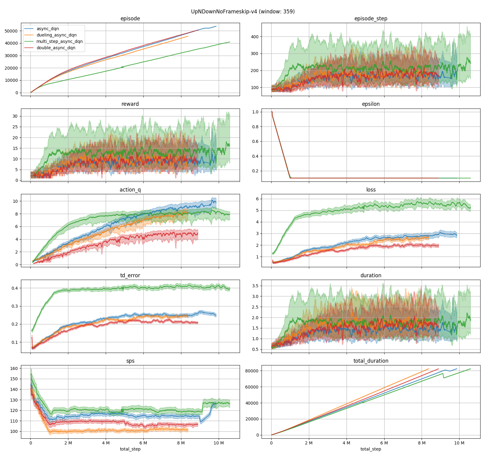

# myrl
reinforcement learning algorithm implementations

> TODO: add NoisyNet learning curve

Currently implemented:
- Vanilla DQN [[1]](#References) [[2]](#References)
- Async DQN (Not A3C. This is multi-processed DQN)
- Double DQN [[3]](#References)
- Dueling DQN [[4]](#References)
- Multi-step Q-learning DQN [[5]](#References)
- NoisyNet [[6]](#References)

# Installation
- I tested this script on Ubuntu 16 (with NVIDIA Tesla K80) on the Google Cloud Platform.
- `pyenv` ([pyenv/pyenv-installer: This tool is used to install `pyenv` and friends.](https://github.com/pyenv/pyenv-installer#github-way-recommended "pyenv/pyenv-installer: This tool is used to install `pyenv` and friends."))
  is strongly recommended for building a python environment.
- atari-py requires `cmake`, `zlib`, etc. Install them first (`apt-get install make cmake zlib1g-dev g++`).

## GPU support
see: [Installation Guide — CuPy 4.3.0 documentation](http://docs-cupy.chainer.org/en/stable/install.html "Installation Guide — CuPy 4.3.0 documentation")

- Install CUDA on your host.
  - [CUDA Toolkit 9.2 Download | NVIDIA Developer](https://developer.nvidia.com/cuda-downloads "CUDA Toolkit 9.2 Download | NVIDIA Developer")
- If you use cupy-recommended environment (https://docs-cupy.chainer.org/en/stable/install.html#recommended-environments),
  cuDNN and NCCL libraries are included in `cupy` wheels.
  - `$ pip install cupy-cuda92`

# Usage
- `python train.py myrl/configs/vanilla_dqn.toml PongNoFrameskip-v4`
  - for more detail see `python train.py --help`

# References
- [1] [Mnih, V., K. Kavukcuoglu, D. Silver, A. Graves, I. Antonoglou, D. Wierstra, and M. Riedmiller. 2013. Playing Atari with Deep Reinforcement Learning. NIPS.](https://arxiv.org/abs/1312.5602)
- [2] [Mnih, V., K. Kavukcuoglu, D. Silver, A. A. Rusu, J. Veness, M. G. Bellemare, A. Graves, M. Riedmiller, A. K. Fidjeland, G. Ostrovski, S. Petersen, C. Beattie, A. Sadik, I. Antonoglou, H. King, D. Kumaran, D. Wierstra, S. Legg, and D. Hassabis. 2015. Human-level control through deep reinforcement learning. Nature.](https://web.stanford.edu/class/psych209/Readings/MnihEtAlHassibis15NatureControlDeepRL.pdf)
- [3] [van Hasselt, H., A. Guez, and D. Silver. 2016. Deep Reinforcement Learning with Double Q-learning. AAAI.](https://arxiv.org/abs/1509.06461)
- [4] [Wang, Z., T. Schaul, M. Hessel, H. van Hasselt, M. Lanctot, and N. de Freitas. 2016. Dueling Network Architectures for Deep Reinforcement Learning. ICML.](https://arxiv.org/abs/1511.06581)
- [5] [Sutton, R. S. 1988. Learning to Predict by the Method of Temporal Differences. Machine Learning.](https://pdfs.semanticscholar.org/9c06/865e912788a6a51470724e087853d7269195.pdf)
- [6] [Fortunato, M., M. G. Azar, B. Piot, J. Menick, I. Osband, A. Graves, V. Mnih, R. Munos, D. Hassabis, O. Pietquin, C. Blundell, and S. Legg. 2018. Noisy Networks for Exploration. ICLR.](http://arxiv.org/abs/1706.10295)
